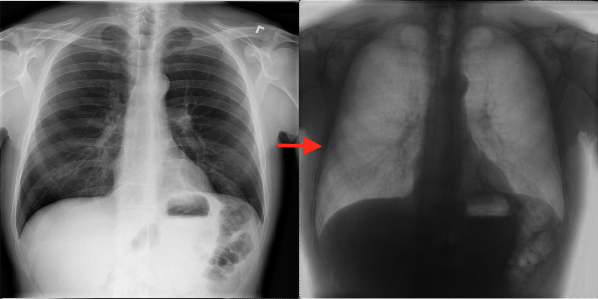

# Bone Suppression from Chest Radiographs

The project is a tool to build **Bone Suppression** model, written in tensorflow

## What is [Bone Suppression](https://www.researchgate.net/publication/320252756_Deep_learning_models_for_bone_suppression_in_chest_radiographs?enrichId=rgreq-7b19be48d9763ea61b22252eaf96edca-XXX&enrichSource=Y292ZXJQYWdlOzMyMDI1Mjc1NjtBUzo1ODQ1MzY0NDY0ODAzODRAMTUxNjM3NTc1NzU5Nw%3D%3D&el=1_x_3&_esc=publicationCoverPdf)?
Bone suppression is an autoencoder-like model for eliminating bone shadow from Chest X-ray images. The model require two types of dataset: normal  and bone-suppression X-ray images. The target model can suppress bone shadow from Chest X-ray images, help Radiologists diagnose better lung related diseases. Although there are some softwares supporting bone suppression ([ClearRead](https://www.riveraintech.com/clearread-xray/), [CareStream](https://www.itnonline.com/content/carestream%E2%80%99s-new-bone-suppression-software-receives-fda-clearance)), this project is a practical open source in computer vision and deep learning.

## In this project you can
1. Train/test by following the quickstart. You can get a model with performance close to the paper.
2. Every time you do a new experiment, make sure you modify `TRAIN`->`output_dir` in `config.ini` otherwise previous training results might be overwritten. For more options check the parameter description in `config.ini`.
3. Modify `queue_capacity`, `capacity`, `min_after_dequeue`, `num_threads` to be suitable with your training machine.
4. Enable/disable data preprocessing part, including registration and augmentation.

## Requirements
The project requires `Python>=3.5` and `Tensorflow>=1.4.1` (both cpu or gpu work well). I have run on a Google Cloud instance, with `1 Tesla K80 (12G)`, `8 vCPUs` and `52 GB memory` and it takes 60 hours for training.

## Configuration
### DATA
1. Download all [JSRT dataset](https://gg-l.xyz/17UWm0Co1W) and [BSE-JSRT dataset](https://gg-l.xyz/jWGsWkt). These dataset is preprocessing with jpg format, which can be fed directly to the model. Extract the dataset to `data/jsrt` and `data/bse_jsrt` or you can edit `jsrt_source_dir` and `bse_jsrt_source_dir` in `config.ini`
2. To register the dataset, make sure you set `image_registration` to `true`, and the registered images will be saved to x and y sub-directory of `registered_images_dir`. Before feeding to training model, the origin image (like left image in the top) should be inverted, to do that, set `need_invert` to true. The dataset I give you has been already inverted.
3. To augment the dataset, make sure you set `augment_data` to `true`, the the `registered_images_dir` will be used to load data. The total data after augmentation = `augmentation_seed` x total number of images in `registered_images_dir`. The augmented images will be saved to x and y sub-directory of `augmented_images_dir` with `.jpeg` extension.

### TRAIN
1. `x_pattern` and `y_pattern` are file patterns to load training images.
2. `queue_capacity`, `capacity`, `min_after_dequeue` and `num_threads` are used for input pipeline, the larger number is set, the larger memory will be used. Current values work well on my machine.
3. Make sure you copy some image pairs (10 is recommended) from `registered_images_dir` to `x_test_dir` and `y_test_dir` for calculating the loss value during training.
4. If you want to continue training from your last model, set `use_trained_model` to true and `trained_model` to your model path.
5. `output_dir` is where you save your model during training
6. The other parameters is set following the published paper

### TEST
1. `model` is trained model to load
2. `input_dir` is where you put all images to encode
3. `need_invert` is true if all images in `input_dir` need to be inverted before encoding
4. `output_dir` is where to save all encoded images. These images will have `encoded_` as prefix

## Quickstart
**Note that currently this project can only be executed in Linux and macOS. You might run into some issues in Windows.**
1. Create & source a new virtualenv.
2. Install dependencies by running `pip3 install -r requirements.txt`.
3. Run `python train.py` to train a new model.
4. Run `python test.py` to evaluate your model on the test set.

## Acknowledgement
I would like to thank [LoudeNOUGH](https://github.com/LoudeNOUGH/bone-suppression) for scratch training script and Hussam Habbreeh (حسام هب الريح) for sharing his experiences on this task.

## Author
Chuong M. Huynh (minhchuong.itus@gmail.com)

## License
MIT
